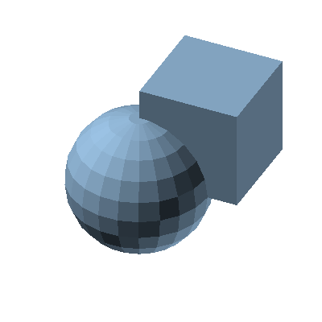
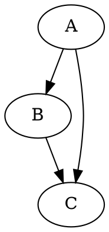
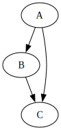

# md-babel-py

Execute code blocks in markdown files with session support.

```sh skip
pip install md-babel-py
```

## Quick Start

Run all code blocks in a markdown file:

```sh skip
md-babel-py run document.md
```

Results are inserted as `<!--Result:-->` blocks after each code block.

## Features

- **Session support**: Blocks can share state via persistent REPL sessions
- **Multiple languages**: Configure any language with a command-line interpreter
- **Expected errors**: Test that code blocks fail as expected (for documentation)
- **Skip/no-result flags**: Control which blocks execute and show output

## Usage

```sh skip
# Edit file in-place
md-babel-py run document.md

# Output to separate file
md-babel-py run document.md --output result.md

# Print to stdout (for piping)
md-babel-py run document.md --stdout

# Only run specific languages
md-babel-py run document.md --lang python,sh

# Dry run - show what would execute
md-babel-py run document.md --dry-run

# Verbose output for debugging
md-babel-py -v run document.md
```

## Code Block Syntax

````markdown
```python session=main
x = 42
```
````

### Flags

| Flag | Description |
|------|-------------|
| `session=NAME` | Share state with other blocks using the same session name |
| `expected-error` | Expect this block to fail; test fails if it succeeds |
| `skip` | Don't execute this block |
| `no-result` | Execute but don't insert result block |

### Custom Parameters

Any `key=value` pair in the info string (except `session`) becomes a custom parameter that can be used in the evaluator command via `{key}` placeholders:

````markdown
```diagon mode=GraphDAG
A -> B
B -> C
```
````

With config:
```json skip
{
  "diagon": {
    "path": "diagon",
    "defaultArguments": ["{mode}", "-style=Unicode"]
  }
}
```

The `{mode}` placeholder is replaced with `GraphDAG` from the code block.

## Configuration

Create `config.json` in your project directory or `~/.config/md-babel/config.json`:

```json
{
  "evaluators": {
    "codeBlock": {
      "python": {
        "path": "/usr/bin/env",
        "defaultArguments": ["python3"],
        "session": {
          "command": ["python3", "-i"],
          "prompts": [">>> ", "... "]
        }
      },
      "sh": {
        "path": "/bin/sh",
        "defaultArguments": []
      },
      "node": {
        "path": "/usr/bin/env",
        "defaultArguments": ["node"],
        "session": {
          "command": ["node"],
          "prompts": ["> ", "... "]
        }
      }
    }
  }
}
```

### Session Configuration

- `command`: Command to start the REPL
- `marker`: Custom marker command (optional, has built-in defaults)
- `prompts`: REPL prompt patterns to strip from output (optional)

### File-based Evaluators

For tools that read from files instead of stdin, or output to files:

```json skip
{
  "openscad": {
    "path": "xvfb-run",
    "defaultArguments": [
      "-a", "openscad",
      "-o", "{output_file}",
      "--colorscheme", "{colorscheme}",
      "--imgsize", "{size}",
      "{input_file}"
    ],
    "inputExtension": ".scad",
    "outputExtension": ".png",
    "outputIsImage": true
  }
}
```

- `inputExtension`: Write code to temp file with this extension (use `{input_file}` placeholder)
- `outputExtension`: Create temp output file with this extension (use `{output_file}` placeholder)
- `outputIsImage`: If true, result shows markdown image link instead of file contents

## Examples

### Basic Execution

```python
print("Hello, world!")
```

<!--Result:-->
```
Hello, world!
```

### Session State

Variables persist across blocks in the same session:

```python session=demo
x = 10
y = 20
```


```python session=demo
print(f"x + y = {x + y}")
```

<!--Result:-->
```
x + y = 30
```

### Expected Errors

Use `expected-error` to document code that should fail:

```python expected-error
raise ValueError("This error is expected")
```

<!--Error:-->
```
Traceback (most recent call last):
  File "<stdin>", line 1, in <module>
ValueError: This error is expected

Exit code: 1
```

### Shell Commands

```sh
echo "Current directory: $(pwd)"
```

<!--Result:-->
```
Current directory: /home/lesh/coding/md-babel-python
```

### OpenSCAD (File-based Output)

Generate 3D renderings. Use `output=path` to specify the output file:

```openscad output=assets/cube-sphere.png
cube([10, 10, 10]);
sphere(r=7);
```

<!--Result:-->


### Graphviz



<!--Result:-->


## Exit Codes

- `0`: All blocks executed successfully
- `1`: Execution error or test failure

For `expected-error` blocks, the test fails (exit 1) if the block succeeds.

## Development

```sh skip
# Install in development mode
pip install -e ".[dev]"

# Run tests
pytest tests/ -v

# Type checking
mypy md_babel_py/

# Lint
ruff check md_babel_py/
```

## License

MIT
