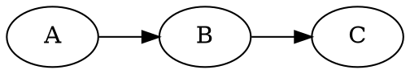
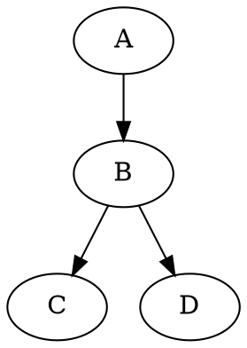

# Integration Test

## Session support

```python session=main
x = 42
print(f"x is {x}")
```

```results
x is 42
```

```python session=main
y = x * 2
print(f"y is {y}")
```

```results
y is 84
```

## Expected error

```python expected-error
# This should fail - no session, x is not defined
print(f"x is {x}")
```

```error
Traceback (most recent call last):
  File "/tmp/tmpjy6my2m7.py", line 2, in <module>
    print(f"x is {x}")
                  ^
NameError: name 'x' is not defined

Exit code: 1
```

## Skip

```python skip
# This block won't run
this_would_error()
```

## No-result (but still executes in session)

```python session=main no-result
# This runs but doesn't insert result
z = y + 10
```

```python session=main
# Should see z from previous block
print(f"z is {z}")
```

```results
z is 94
```

## Graphviz (raw mode)


```graphviz output=tests/output/graphviz-basic.svg
digraph {
  rankdir=LR
  A -> B -> C
}
```



```graphviz output=tests/output/graphviz-args.svg args=-Grankdir=TB
digraph {
  A -> B -> C
  B -> D
}
```


